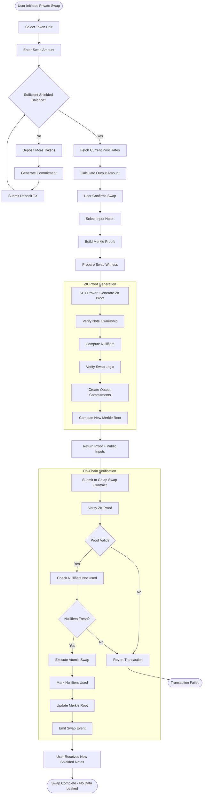
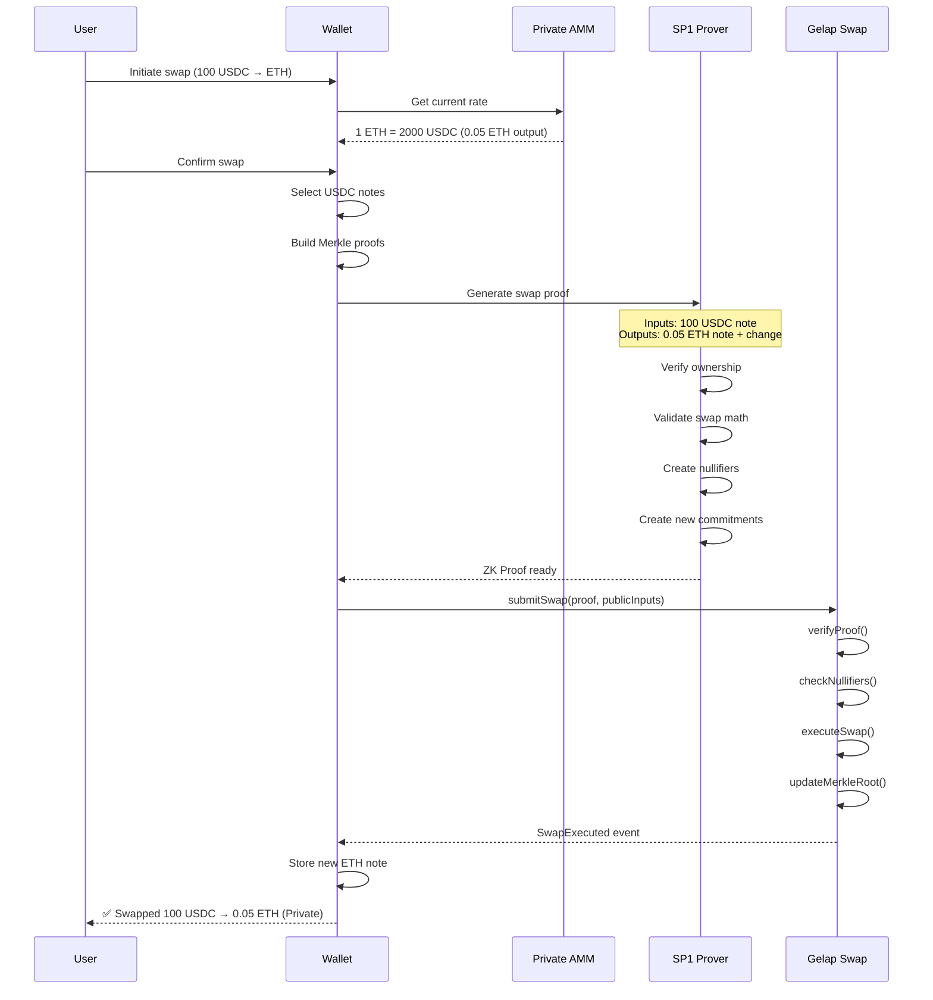

# Private Swap - Activity Diagram

## Use Case: Confidential Token Exchange

User wants to swap Token A for Token B **without revealing**:
- Swap amount
- Wallet address
- Trading history

---

## Activity Diagram



---

## Sequence Flow



---

## What's Private vs Public

| Data Point | Status |
|------------|--------|
| Swap amount | 🔒 Private |
| Token types | 🔒 Private |
| User address | 🔒 Private |
| Swap rate used | 🔒 Private |
| Swap occurred | 🌐 Public (event emitted) |
| Pool total liquidity | 🌐 Public |

---

## Key Components

### Private AMM Pool
```
┌─────────────────────────────────────┐
│        SHIELDED LIQUIDITY POOL      │
├─────────────────────────────────────┤
│  Token A Pool ◄──────► Token B Pool │
│       │                    │        │
│  [Hidden Balances via Commitments]  │
│                                     │
│  Swap = ZK Proof of valid trade     │
└─────────────────────────────────────┘
```

### Atomic Swap Logic (Inside ZK Proof)
```
PROVE:
  1. I own input notes worth X of Token A
  2. Output amount Y of Token B is correct per AMM formula
  3. Nullifiers are correctly derived
  4. New commitments are valid
  5. No tokens created or destroyed
```
